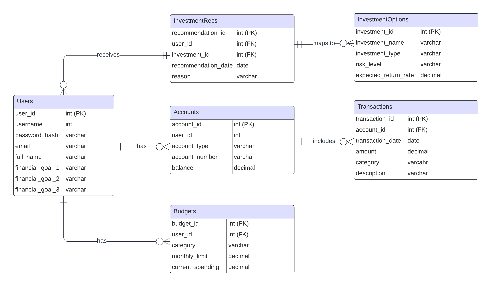

# Design Document

By Andrada Pantelimon

Video overview: <URL HERE>

## Scope

* Purpose of the database:
The purpose of this database is to create a simplified personal finance application that allows users to manage their finances efficiently. Users can visualize their total wealth across multiple accounts, track transactions, manage budgets, and receive personalized investment recommendations to improve their financial health.

* Entities included in the scope of the database:
- Users
- Accounts (bank accounts, savings, retirement funds, investments)
- Transactions
- Budgets
- Investment Options
- Investment Recommendations

* Entities excluded from the scope of the database:
- Detailed stock market data
- Real-time financial market tracking
- Advanced investment strategies
- Multi-currency support
- Credit score improvement strategies
- Personalized credit card and loan recommendations
- Opening accounts, like checking and savings

## Functional Requirements

* User capabilities within the scope of the database:
- Register and log in to the application
- Set 3 financial goals
- View a summary of their financial status, including balances across all accounts
- Track and categorize transactions from various accounts
- Set and manage budgets for different spending categories
- Receive recommendations on reducing unnecessary expenses
- Get personalized investment advice based on their financial goals preferences

* Functionalities outside the scope of the database:
- More 3 financial goals per user and additional lifestyle preferences
- Automated integration with financial institutions for real-time data updates
- Advanced financial planning tools and simulations
- Peer-to-peer payment functionalities

## Representation

**Entity Relationship Diagram**

### Entities

This section shows the entities represented in the database.

**Users**
- `user_id` (Primary Key)
- `username`
- `password_hash`
- `email`
- `full_name`
- `financial_goal_1`
- `financial_goal_2`
- `financial_goal_3`
- **Attributes:** These attributes capture essential personal and financial preference information needed to tailor the app's functionalities to each user.
- **Type:** The data types include integers for IDs, strings for text fields, and hashed strings for passwords to ensure security.
- **Constraints:** Unique constraints on `username` and `email` to prevent duplicates and ensure each user is uniquely identifiable.

**Accounts**
- `account_id` (Primary Key)
- `user_id` (Foreign Key)
- `account_type` (e.g., checking, savings, retirement, investment)
- `account_number`
- `balance`
- **Attributes:** These attributes describe the various types of accounts users may have, along with their details.
- **Types:** The data types include integers for IDs, strings for text fields, and floats for monetary amounts to handle balances.
- **Constraints:** Foreign key constraint on `user_id` to ensure account association with the correct user.

**Transactions**
- `transaction_id` (Primary Key)
- `account_id` (Foreign Key)
- `transaction_date`
- `amount`
- `category` (e.g., groceries, rent, utilities)
- `description`
- **Attributes:** These attributes record detailed information about each transaction made by users.
- **Types:** The data types include integers for IDs, dates for transaction dates, floats for amounts, and strings for categories and descriptions.
- **Constraints:** Foreign key constraint on `account_id` to ensure transactions are linked to the correct account.

**Budgets**
- `budget_id` (Primary Key)
- `user_id` (Foreign Key)
- `category`
- `monthly_limit`
- `current_spending`
- **Attributes:** These attributes allow users to set and track their budgets across different spending categories.
- **Types:** The data types include integers for IDs, strings for categories, and floats for monetary amounts.
- **Constraints:** Foreign key constraint on `user_id` to ensure budgets are linked to the correct user.

**InvestmentOptions**
- `investment_id` (Primary Key)
- `investment_name`
- `investment_type` (e.g., fund, ETF)
- `risk_level`
- `expected_return_rate`
- **Attributes:** These attributes provide details about various investment options available to users.
- **Types:** The data types include integers for IDs, strings for text fields, and floats for numerical values.
- **Constraints:** Unique constraint on `investment_name` to prevent duplicates.

**InvestmentRecs**
- `recommendation_id` (Primary Key)
- `user_id` (Foreign Key)
- `investment_id` (Foreign Key)
- `recommendation_date`
- `reason` (why this investment is recommended)
- **Attributes:** These attributes record personalized investment recommendations for users.
- **Types:** The data types include integers for IDs, dates for recommendation dates, and strings for reasons.
- **Constraints:** Foreign key constraints on `user_id` and `investment_id` to ensure recommendations are linked to the correct user and investment.

### Relationships

This section includes the entity relationship diagram and describes the relationships between the entities in the database.

- **Users** have many **Accounts** (one-to-many relationship).
- **Accounts** have many **Transactions** (one-to-many relationship).
- **Users** have many **Budgets** (one-to-many relationship).
- **InvestmentOptions** are recommended to **Users** (many-to-many relationship through **InvestmentRecs**).

## Optimizations

This section outlines the optimizations (indexes, views) created and a brief rationale.

**Indexes:**
- Created indexes on `user_id` in **Accounts**, **Budgets**, and **InvestmentRecs** tables to speed up user-specific queries.
- Created an index on `account_id` in **Transactions** to improve performance when retrieving transactions for an account.

**Views:**
- Created a view to summarize user financial status, aggregating balances from all accounts for a quick overview.
- Created a view for budget tracking, showing current spending versus budget limits for each category.

## Limitations

This section outlines the limitations of the database design and data that cannot be represented well with the current design.

- For simplicity, the database limits user financial goals to 3, without additional lifestyle and personalization aspects.
- The database does not support real-time integration with financial institutions, meaning data updates need to be done manually.
- Advanced investment strategies and detailed stock market data are not represented, limiting the scope of investment recommendations.
- Multi-currency support is not included, which may limit usability for users with international finances.
- The current design does not support peer-to-peer payments or transaction splitting among multiple users.
- Credit score improvement strategies are not included.
- Personalized credit card and loan recommendations are out of scope.
- Opening accounts, like checking and savings, is also out of scope.
